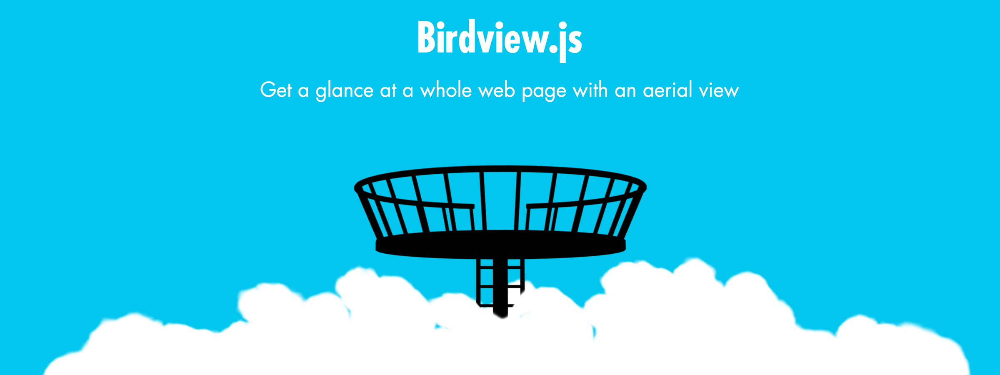

# Birdview.js



**Get a glance at a whole web page with an aerial view.**

See [**demo & full documentation here**](https://www.achrafkassioui.com/birdview/).

## Setup

Include `birdview.js` and `birdview.css` in HTML:

```
<link rel="stylesheet" type="text/css" href="birdview.css"/>
<script type="text/javascript" src="birdview.js"></script>
```

Enable Birdview with the initialization method:

```
birdview.init();
```

## Usage

To trigger birdview, you can either:

- **Press the Z key**
- **Pinch-in** on a touch device

You can also trigger birdview by clicking any HTML element with a `birdview_toggle` class:

```
<button class="birdview_toggle">Birdview</button>
```

Or you can toggle birdview programmatically using the toggle method:

```
birdview.toggle();
```

You can stop birdview from running on your page by calling:

```
birdview.destroy();
```

The destruction method is called inside the initialization method. Calling `birdview.init()` multiple times shouldn't create any undesirable overlapping.
